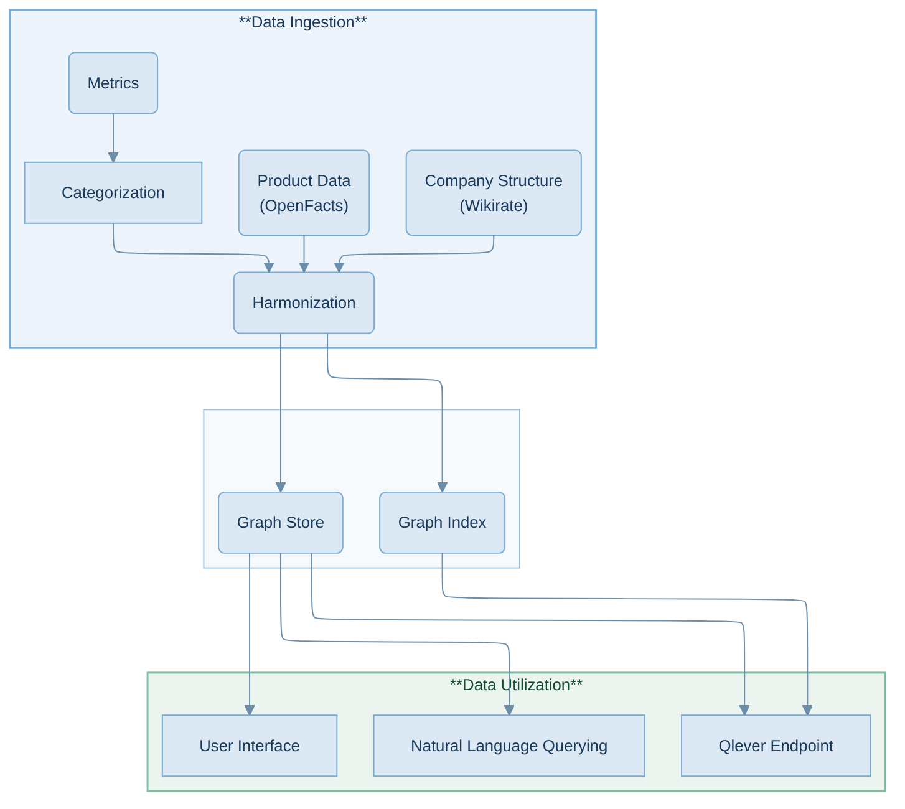

```mermaid
---
config:
    layout: elk
    theme: base
    themeVariables:
        primaryColor: "#DCE9F5"
        primaryBorderColor: "#7AADD4"
        primaryTextColor: "#1A3A5C"
        secondaryColor: "#DFF0E8"
        secondaryBorderColor: "#7ABFA0"
        secondaryTextColor: "#124D30"
        tertiaryColor: "#EFE9F8"
        tertiaryBorderColor: "#A18CC7"
        tertiaryTextColor: "#3B1F6B"
        clusterBkg: "#F7FAFD"
        clusterBorder: "#99BDD9"
        lineColor: "#6B8EAA"
        edgeLabelBackground: "#F4F7FA"
        nodeTextColor: "#1A3A5C"
        titleColor: "#1A3A5C"
        fontFamily: "Inter, Helvetica Neue, sans-serif"
        fontSize: "13px"
---
flowchart TD
    

    subgraph DataIn["**Data Ingestion**"]
        IN1("Company Structure <br> (Wikirate)") & IN2("Product Data  <br> (OpenFacts)") & IN3("Metrics")
        IN3 --> METR["Categorization"]
        IN1 & IN2 & METR --> HARM("Harmonization")
    end

    subgraph A[" "]
        GS("Graph Store") & GI("Graph Index")
    end
    HARM --> GS & GI


    subgraph DataOut["**Data Utilization**"]
        GS --> CLI["Natural Language Querying"]
        GS & GI --> QL["Qlever Endpoint"]
        GS --> UI["User Interface"]
    end

    style DataIn fill:#EEF4FB,stroke:#7AADD4,stroke-width:1.5px,color:#1A3A5C
    style DataOut    fill:#EBF4EE,stroke:#7ABFA0,stroke-width:1.5px,color:#124D30
    %% style SIM  fill:#EFE9F8,stroke:#A18CC7,stroke-width:1px,color:#3B1F6B
    %% style LOSS fill:#EFE9F8,stroke:#A18CC7,stroke-width:1px,color:#3B1F6B
```
