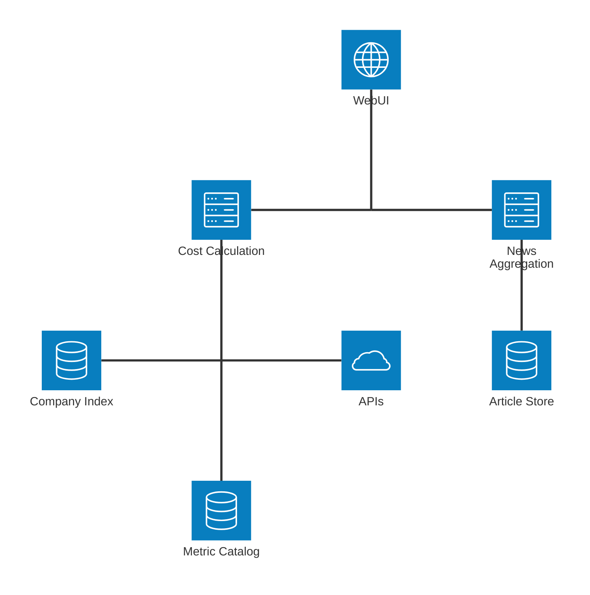

Problem
---

# price only tells half the story
* social & environmental issues are ignored too often
<!-- new_line -->
* things marketed as sustainable are often greenwashed

<!-- jump_to_middle -->

<!-- pause -->
# people forget
* even well documented wrongdoing only gets a flash of attention
<!-- new_line -->
* the information is available, just at the wrong time
<!-- new_line -->
* Opinions are shapeable, PR is meant to distract

<!-- end_slide -->

Idea
---

# Generate Hidden Cost Report
* one stop shop to highlight disconnect between currency and societal value

<!-- jump_to_middle -->
<!-- pause -->

# workflow
* user scans barcode / searches for company
<!-- new_line -->
* enrich query (company from product, subsidiaries from company, ...)
<!-- new_line -->
* aggregate data from different sources in different formats (federated search) and filter for usable / relevant / up-to-date
<!-- new_line -->
* process data by type:
    * metrics -> comparison to similar products / approximate cost
    * articles -> nlp magic (snippet extraction / llm processing)
<!-- new_line -->
* display as dashboard

<!-- end_slide -->

Architecture
--- 

<!-- end_slide -->

Evaluation
---

# Cost Calculation 
* Coverage: fraction of available datapoints included in final calculation
<!-- new_line -->
* Sanitycheck: Does high hidden cost correlate with real fines or low ESG scores?

<!-- jump_to_middle -->
<!-- pause -->
# Article Search
* Manual: label relevant articles, check precision / recall
<!-- new_line -->
* Go(oog)ld standard: compare to search results for queries like \<company\> + scandal

<!-- end_slide -->

Notes
---

## adding sources should be easy
<!-- pause -->
## possible llm integration for specific questions
<!-- pause -->
## may need classifier to map from metric to catalog entry

