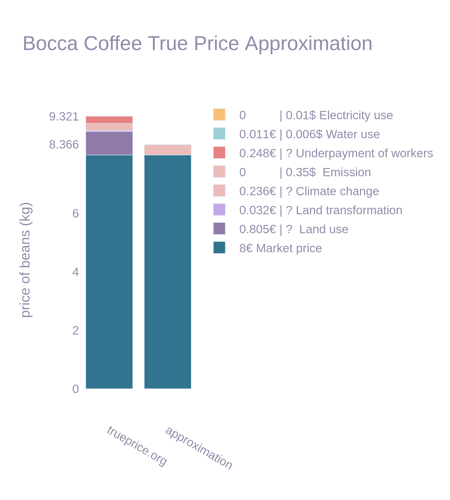

<style>
  section {
        /* background-image: url('res/boschfooter.png'); */
        background-repeat: no-repeat;
        background-position: bottom 0px right;
        background-size: 100% 30px ;
    }
    ul {
        font-size: 0.8em;
    }
</style>


# HiddenCostReport
### _Open Data Fusion for Approximate True Cost Accounting using Knowledge Graphs_

<span style="color:grey"> Research Project by</span> 
<span style=""> Bileam Scheuvens</span>  <br>
<span style="color:grey"> under supervision of</span> 
<span style=""> Dr. Harry Scells</span> 

---

## Overview
- Situation - why this work is necessary
* What is TCA 
* Can we scale it
* Demo
* Limitations


---

## Motivation

* price is a bad measure of value to society
    * unfair distribution
    * planned obsolescence
    * ecological disaster
* the economy is reward hacking
* can we do better?

<!-- 
- since barter days, price reflects value 
- limited in scope
- rules are uneven globally

- target is a bad measure
- we want best, not loopholes
- alternatives failed

-->


---

### Why Health NLP lab?


* originally information retrieval
* now mostly data fusion & harmonization

--- 


#### _<span style="color:grey; font-size: 14pt"> Open Data Fusion for Approximate </span> True Cost Accounting <span style="color:grey;font-size:14pt">using Knowledge Graphs</span>_


--- 

## What is True Cost Accounting


* internalize everything
    * restoration 
    * compensation
    * retribution 
    * prevention of re-occurence
* tedious, difficult, temporary...
* can we automate this?

<!-- 
- make up for damages
- pay those affected 
- penalties
- audits, structural changes
-->


---

## Scaling True Cost Accounting 

* gather open data
* define common units & measurements
* make lots of assumptions

---

## Scaling True Cost ~~Accounting~~ _Approximation_


- Bocca Coffee
    * Revenue: $\$6.9 \ million$
    * Emissions: $100\ tonnes\ CO_2\ equivalent$ ?
        -> * 300$/ton (Kikstra 2021)
    * Electricity:  $100\ Mwh$ ?
        -> 70$/Mwh (Sovacool 2021)
    * Water usage: $1000m^3$ ?
        -> * 1$/m3 ?
       
* Assume all products are proportionally reponsible for externalities

---

## Scaling True Cost ~~Accounting~~ _Approximation_


- Bocca Coffee
    - Revenue: $\$6.9 \ million$
    - Emissions: $100\ tonnes\ CO_2\ equivalent$ ?
        -> * 300$/ton (Kikstra 2021)
    - Electricity:  $100\ Mwh$ ?
        -> 70$/Mwh (Sovacool 2021)
    - Water usage: $1000m^3$ ?
        -> * 1$/m3 ?


---

#### _Open Data Fusion <span style="color:grey; font-size: 14pt"> for Approximate True Cost Accounting using Knowledge Graphs</span>_
---

## Methodology
- gather data
* harmonize, categorize, assign costs
* link to product
* calculate hidden cost


---

#### _<span style="color:grey; font-size: 14pt"> Open Data Fusion for Approximate True Cost Accounting using</span> Knowledge Graphs_

---

### Why Knowledge Graphs?

<div class="textcolumns"> 

<div style="font-size: 23px"> 

* flexibility
* extensibility 
* complexity of queries

</div>
<div>

```rdf
:bocca  :is_a     :company
:bocca  :produces :coffee

:coffee :is_a     :beverage
:coffee :contains :caffeine
```

```sparql
>> ?company :produces :beverage .
-> bocca
```

</div>
</div>


<!-- -->


---

## Data Ingestion


* Selecting Sources
    - Wikirate (1k companies & 1k metrics)
    - OpenFoodFacts
    - OpenProductsFacts
* harmonize


---

### Source Categorization

<div class="textcolumns"> 

<div style="font-size: 28px"> 

- ontology design is hard
* Keyword matching (current approach)
    * brittle
    * Deduplication is nontrivial
        - unclear authority
        - differences in gathering / processing
        - unreliable self reporting


</div>

<div style="font-size: 13px"> 

metric class                          | #  | metric class                  | #  |
--------------------------------------|----|-------------------------------|----|
derived                               | 52 | disclosure_rate               | 70 |
disclosure_single                     | 99 | electricity_consumption       | 35 |
emission                              | 16 | emission_scope_1              |  5 |
emission_scope_12                     |  5 | emission_scope_123            |  2 |
emission_scope_13                     |  3 | emission_scope_2              |  3 |
emission_scope_23                     |  1 | emission_scope_3              |  2 |
revenue                               |  1 | unmapped                      |681 |
waste                                 |  2 | waste_hazardous               |  1 |
waste_hazardous_recycled              |  1 | waste_nonhazardous            |  1 |
waste_nonhazardous_recycled           |  1 | waste_recycled                |  1 |
water                                 | 11 | water_recycled                |  3 |
water_withdrawal                      |  4 |                               |    |

</div> 
</div>

---
### Cost Assignment

<div style="font-size: 12px; overflow-y: auto; max-height: 500px"> 


|indicator                     |Area         |footprint indicator                                                     |factor      |unit                                        |Remedy type                                                                                         |
|-                             |-            |-                                                                       |-           |-                                           |-                                                                                                   |
|airp_acid                     |Environmental|Acidification                                                           |5.47        |EUR/kg SO2 eq                               |Compensation - Ecosystem                                                                            |
|airp_ozone                    |Environmental|Ozone layer depleting emissions                                         |70.4        |EUR/kg CFC-11eq                             |Compensation - Ecosystem, Compensation - Health                                                     |
|airp_pm                       |Environmental|Particulate matter (PM) formation                                       |81.3        |EUR/kg PM2.5-eq                             |Compensation - Health                                                                               |
|airp_smog_eco                 |Environmental|Photochemical oxidant formation (POF): damage ecosystems                |3.33        |EUR/kg NOx-eq                               |Compensation - Ecosystem                                                                            |
|airp_smog_hh                  |Environmental|Photochemical oxidant formation (POF): damage human health              |0.118       |EUR/kg NOx-eq                               |Compensation - Health                                                                               |
|airp_tox_freshwater           |Environmental|Toxic emissions to air Freshwater ecotoxicity                           |0.0472      |EUR/kg 1,4-DB eq                            |Compensation - Ecosystem                                                                            |
|airp_tox_human                |Environmental|Toxic emissions to air Human toxicity                                   |129,000     |EUR/DALY                                    |Compensation - Health                                                                               |
|airp_tox_marine               |Environmental|Toxic emissions to air Marine ecotoxicity                               |0.00215     |EUR/kg 1,4-DB eq                            |Compensation - Ecosystem                                                                            |
|airp_tox_terrestrial          |Environmental|Toxic emissions to air Terrestrial ecotoxicity                          |0.000294    |EUR/kg 1,4-DB eq emitted to industrial soil |Compensation - Ecosystem                                                                            |
|climate                       |Environmental|Greenhouse gas (GHG) emissions                                          |0.312       |EUR/kgCO2eq                                 |Compensation                                                                                        |
|fossil                        |Environmental|Fossil fuel depletion                                                   |0.560       |EUR/kg oil eq                               |Compensation - Economic                                                                             |
|land_occupation_coastalwetland|Environmental|Land occupation coastal wetland                                         |12,800      |EUR/(ha*yr)                                 |Compensation                                                                                        |
|land_occupation_grassland     |Environmental|Land occupation grassland/savannah                                      |2,830       |EUR/(ha*yr)                                 |Compensation                                                                                        |
|land_occupation_inlandwetland |Environmental|Land occupation inland wetland                                          |17,400      |EUR/(ha*yr)                                 |Compensation                                                                                        |
|land_occupation_otherforest   |Environmental|Land occupation other forest                                            |1,180       |EUR/(ha*yr)                                 |Compensation                                                                                        |
|land_occupation_tropicalforest|Environmental|Land occupation tropical forest                                         |2,470       |EUR/(ha*yr)                                 |Compensation                                                                                        |
|land_occupation_woodland      |Environmental|Land occupation woodland/shrubland                                      |1,600       |EUR/(ha*yr)                                 |Compensation                                                                                        |
|land_trans_coastalwetland     |Environmental|Land transformation coastal wetland                                     |3,770       |EUR/ha                                      |Restoration                                                                                         |
|land_trans_grassland          |Environmental|Land transformation grassland/savannah                                  |340         |EUR/ha                                      |Restoration                                                                                         |
|land_trans_inlandwetland      |Environmental|Land transformation inland wetland                                      |43,100      |EUR/ha                                      |Restoration                                                                                         |
|land_trans_otherforest        |Environmental|Land transformation other forest                                        |3,120       |EUR/ha                                      |Restoration                                                                                         |
|land_trans_tropicalforest     |Environmental|Land transformation tropical forest                                     |4,510       |EUR/ha                                      |Restoration                                                                                         |
|land_trans_woodland           |Environmental|Land transformation woodland/shrubland                                  |1,290       |EUR/ha                                      |Restoration                                                                                         |
|material                      |Environmental|(Other) non-renewable material depletion                                |0.283       |EUR/kg Cu eq                                |Compensation                                                                                        |
|wateruse                      |Environmental|Scarce blue water use                                                   |1.62        |EUR/m3                                      |Restoration                                                                                         |
|soil_compaction               |Environmental|Soil compaction                                                         |0.64        |EUR/tkm                                     |Compensation - Future earnings                                                                      |
|soildeg_carbon                |Environmental|Soil organic carbon (SOC) loss                                          |0.0353      |EUR/kg SOC loss                             |Compensation - Economic                                                                             |
|soildeg_watererosion          |Environmental|Soil loss from water erosion                                            |0.0268      |EUR/kg soil loss                            |Compensation                                                                                        |
|soildeg_winderosion           |Environmental|Soil loss from wind erosion                                             |0.0343      |EUR/kg soil loss                            |Compensation                                                                                        |
|soilp_tox_freshwater          |Environmental|Toxic emissions to soil Freshwater ecotoxicity                          |0.0472      |EUR/kg 1,4-DB eq                            |Compensation - Ecosystem                                                                            |
|soilp_tox_human               |Environmental|Toxic emissions to soil Human toxicity                                  |129,000.0000|EUR/DALY                                    |Compensation - Health                                                                               |
|soilp_tox_marine              |Environmental|Toxic emissions to soil Marine Ecotoxicity                              |0.00215     |EUR/kg 1,4-DB eq                            |Compensation - Ecosystem                                                                            |
|soilp_tox_terrestrial         |Environmental|Toxic emissions to soil Terrestrial ecotoxicity                         |0.000294    |EUR/kg 1,4-DB eq emitted to industrial soil |Compensation - Ecosystem                                                                            |
|waterp_eu_fresh               |Environmental|Freshwater eutrophication                                               |239         |EUR/kg P eq to freshwater-risk adjusted     |Restoration                                                                                         |
|waterp_eu_marine              |Environmental|Marine eutrophication                                                   |16.6        |EUR/kg N eq to marine water                 |Restoration                                                                                         |
|waterp_tox_freshwater         |Environmental|Toxic emissions to water Freshwater ecotoxicity                         |0.0472      |EUR/kg 1,4-DB eq                            |Compensation - Ecosystem                                                                            |
|waterp_tox_human              |Environmental|Toxic emissions to water Human toxicity                                 |129,000     |EUR/DALY                                    |Compensation - Health                                                                               |
|waterp_tox_marine             |Environmental|Toxic emissions to water Marine Ecotoxicity                             |0.00215     |EUR/kg 1,4-DB eq                            |Compensation - Ecosystem                                                                            |
|waterp_tox_terrestrial        |Environmental|Toxic emissions to water Terrestrial ecotoxicity                        |0.000294    |EUR/kg 1,4-DB eq emitted to industrial soil |Compensation - Ecosystem                                                                            |
|child_audit                   |Social       |Labour force to be audited for child labour                             |8.75        |EUR/FTE                                     |Prevention                                                                                          |
|cl_haz                        |Social       |Hazardous child labour                                                  |42.0        |EUR/hour of hazardous child labour          |Compensation - Future earnings, Compensation - Life quality, Prevention, Prevention, Retribution    |
|cl_non_haz                    |Social       |Non-hazardous child labour                                              |15.3        |EUR/hour of non-hazardous child labour      |Compensation - Future earnings, Compensation - Life quality, Prevention, Retribution                |
|ot_audit                      |Social       |Labour force to be audited for illegal overtime                         |8.75        |EUR/FTE                                     |Prevention                                                                                          |
|ot_illegal                    |Social       |Workers performing illegal overtime                                     |125         |EUR/FTE                                     |Retribution                                                                                         |
|ot_underpaid                  |Social       |Workers performing underpaid overtime                                   |125         |EUR/FTE                                     |Retribution                                                                                         |
|ot_wagegap                    |Social       |Overtime wage gap                                                       |1.03        |EUR/EUR                                     |Compensation - Economic, Compensation - Economic                                                    |
|fl_abuse                      |Social       |Forced workers who are victims of abuse                                 |43,400      |EUR/FTE                                     |Compensation - Economic, Compensation - Health, Compensation - Psychological, Restoration - Health, |
|fl_audit                      |Social       |Labour force to be audited for forced labour                            |8.75        |EUR/FTE                                     |Prevention                                                                                          |
|fl_debt                       |Social       |Forced workers who are in debt bondage                                  |20,600      |EUR/FTE                                     |Restoration - Economic                                                                              |
|fl_workers_high               |Social       |Forced workers (most severe)                                            |139,000     |EUR/FTE                                     |Restoration - Health, Retribution                                                                   |
|fl_workers_low                |Social       |Forced workers (least severe)                                           |14,000      |EUR/FTE                                     |Restoration - Health, Retribution                                                                   |
|fl_workers_med                |Social       |Forced workers (medium severe)                                          |76,600      |EUR/FTE                                     |Restoration - Health, Retribution                                                                   |
|dis_gender_audit              |Social       |Labour force to be audited for discrimination                           |8.75        |EUR/FTE                                     |Prevention                                                                                          |
|dis_gender_eqgap              |Social       |Wage gap from unequal opportunities                                     |1.03        |EUR/EUR                                     |Compensation - Economic, Compensation - Economic                                                    |
|dis_gender_mlgap              |Social       |Value of denied maternity leave                                         |1.03        |EUR/EUR                                     |Compensation - Economic, Compensation - Economic                                                    |
|dis_gender_mlworkers          |Social       |Female workers without maternity leave provision                        |2,000       |EUR/FTE                                     |Retribution                                                                                         |
|dis_gender_wagegap            |Social       |Wage gap from gender discrimination                                     |1.03        |EUR/EUR                                     |Compensation - Economic, Compensation - Economic                                                    |
|income                        |Social       |Income gap                                                              |1.03        |EUR/EUR                                     |Compensation - Economic, Compensation - Economic                                                    |
|dfa                           |Social       |Instances of denied freedom of association                              |430         |EUR/violations                              |Retribution                                                                                         |
|dfa_audit                     |Social       |Labour force to be audited for denied freedom of association            |8.75        |EUR/FTE                                     |Prevention                                                                                          |
|ss_audit                      |Social       |Labour force to be audited for insufficient social security             |8.75        |EUR/FTE                                     |Prevention                                                                                          |
|ss_plgap                      |Social       |Value of denied paid leave                                              |1.03        |EUR/EUR                                     |Compensation - Economic, Compensation - Economic                                                    |
|ss_workers                    |Social       |Workers without legal social security                                   |2,650       |EUR/FTE                                     |Retribution                                                                                         |
|ohs_audit                     |Social       |Labour force to be audited for H&S                                      |8.75        |EUR/FTE                                     |Prevention                                                                                          |
|ohs_breachfte                 |Social       |Work performed in violation of H&S standards                            |2,160       |EUR/FTE                                     |Retribution                                                                                         |
|ohs_breachinj                 |Social       |Occupational injuries with breach of H&S standards                      |4,790       |EUR/incidents                               |Retribution                                                                                         |
|ohs_f                         |Social       |Fatal occupational incidents                                            |3,840,000   |EUR/incidents                               |Compensation                                                                                        |
|ohs_nf_ins                    |Social       |Insured non-fatal occupational incidents                                |4,520       |EUR/incidents                               |Compensation - Health                                                                               |
|ohs_nf_nins                   |Social       |Uninsured non-fatal occupational incidents                              |4,670       |EUR/incidents                               |Compensation - Economic, Compensation - Health                                                      |
|har_audit                     |Social       |Labour force to be audited for harassment                               |8.75        |EUR/FTE                                     |Prevention                                                                                          |
|har_np_ns                     |Social       |Workers experienced non-physical harassment (non-sexual)                |27,800      |EUR/worker                                  |Compensation - Psychological                                                                        |
|har_np_s                      |Social       |Workers experienced non-physical sexual harassment                      |27,800      |EUR/worker                                  |Compensation - Psychological                                                                        |
|har_p_ns                      |Social       |Workers experienced physical harassment (non-sexual)                    |68,500      |EUR/worker                                  |Compensation - Economic, Compensation - Health, Compensation - Psychological, Restoration - Health, |
|har_p_s                       |Social       |Workers experienced physical sexual harassment (non severe)             |76,800      |EUR/worker                                  |Compensation - Economic, Compensation - Health, Compensation - Psychological, Restoration - Health, |
|har_p_ss                      |Social       |Workers experienced severe physical sexual harassment                   |86,100      |EUR/worker                                  |Compensation - Economic, Compensation - Health, Compensation - Psychological, Restoration - Health, |
|wage_audit                    |Social       |Labour force to be audited for insufficient wages                       |8.75        |EUR/FTE                                     |Prevention                                                                                          |
|wage_gap_min                  |Social       |Wage gap workers earning below minimum wage                             |1.53        |EUR/EUR                                     |Compensation - Economic, Compensation - Economic, Retribution                                       |
|wage_gap_minlw                |Social       |Wage gap workers earning above minimum wage but below decent living wage|1.03        |EUR/EUR                                     |Compensation - Economic, Compensation - Economic                                                    |

</div>

---

## Demo

---

## Limitations
- unreliable
* unclear how to handle supply chain
* proprietary / non collected data (e.g. linking brand - company)
* disincentivizes transparency

---

## What now?
- product integration


---

### Thanks for listening!

<div class="textcolumns"> 
<div>

##### Questions, Notes, Ideas?

</div>
<div>

## Sources
- https://unsplash.com/@publicdomainvectors/illustrations
- https://rocketreach.co/bocca-coffee-profile_b4472270fae17b7f
- https://unsplash.com/photos/coffee-bean-lot-TD4DBagg2wE
- https://github.com/Truepricemethod/Monetisation_factors

</div>
</div>
