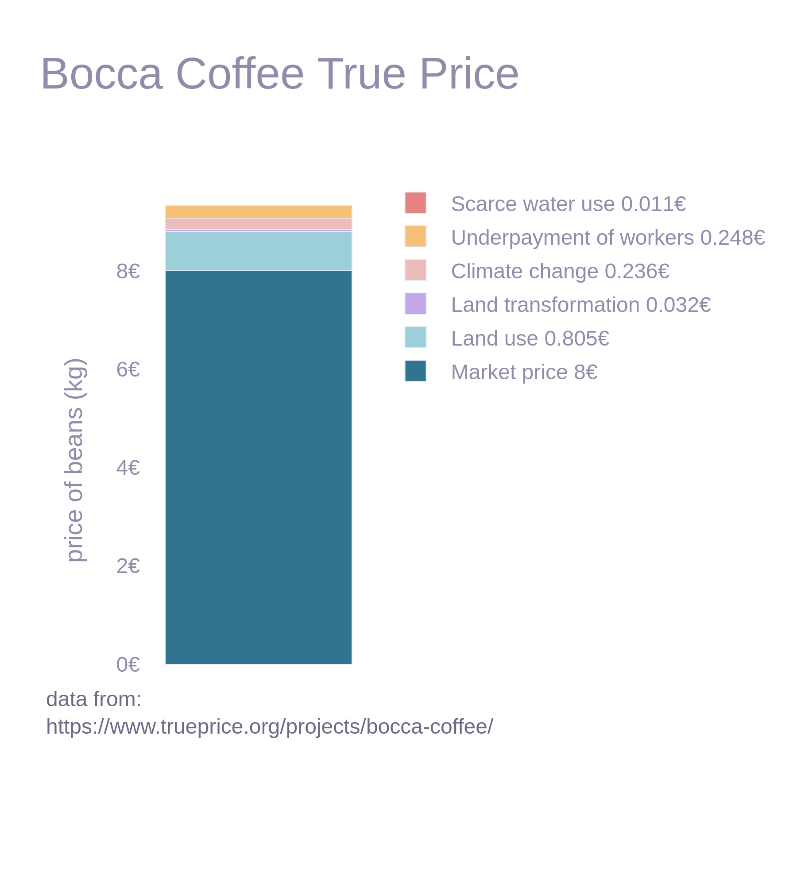
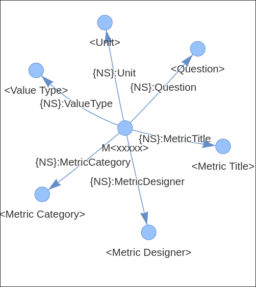

# HiddenCostReport
### _Open Data Fusion for Approximate True Cost Accounting using Knowledge Graphs_

<!-- // = Introduction -->
<!-- // -->
<!-- // - explain why economics fails -->
<!-- // - explain rdf+sparql -->
<!-- // -->
<!-- // -->
<!-- // = Related Work -->
<!-- // - teebagrifood -->
<!-- // - true price method -->
<!-- // -->
<!-- // = Methodology -->
<!-- // - graph construction -->
<!-- //   - sources -->
<!-- //   - harmonization -->
<!-- //     - manual cleanup -->
<!-- //   - categorization -->
<!-- // - graph utilization -->
<!-- //   - qlever -->
<!-- //   - ui -->
<!-- //   - query translation -->
<!-- // -->
<!-- // -->
<!-- // = Evaluation -->
<!-- // - comparison to trueprice reports -->
<!-- // - graph itself (wang21) -->
<!-- // - query translation -->
<!-- // -->
<!-- // = Discussion -->
<!-- // - usefulness -->
<!-- // - shortcomings -->
<!-- // - future work -->
<!-- //   - product level -->
<!-- //   - text integration -->
<!-- //   - better pricing -->
<!-- //   - better category mapping -->

 Research Project by 
 Bileam Scheuvens   
 under supervision of 
 Dr. Harry Scells 

---

## Overview
- Situation - why this work is necessary
- What is TCA  
- Scaling
- 

---

## Situation
- price is a bad measure of societal value
    * unfair distribution
    * planned obsolescene
* the economy is reward hacking

--- 

## What is True Cost Accounting

* internalize everything
    * restoration 
    * compensation
    * retribution 
    * prevention of re-occurence
* tedious, difficult, temporary...
* can we do better?

---

## Why Health NLP lab?

* originally information retrieval
* now mostly data fusion & harmonization
* hopefully still interesting

---

## Scaling True Cost Accounting

* gather public data
* harmonize & categorize sources 
* assign costs
* build graph

---

## Data Ingestion

* Selecting Sources
    - Wikirate
    - OpenProductsFacts
    - OpenFoodFacts
* harmonize

---

### Thanks for listening!
##### Questions, Notes, Ideas?
